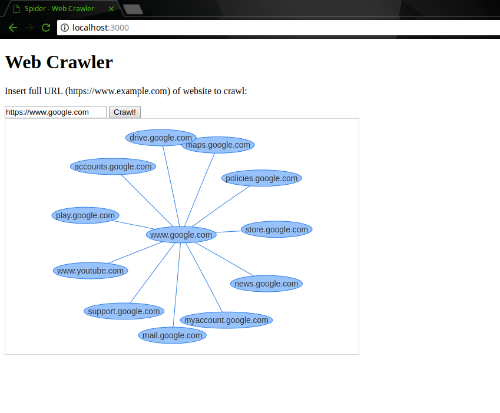
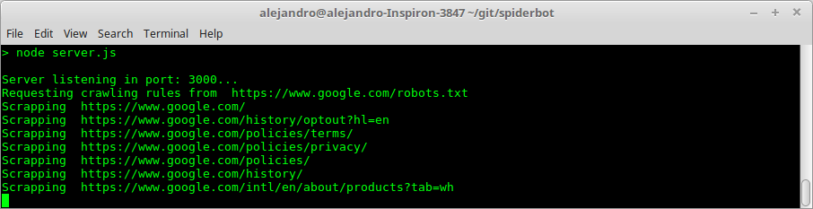
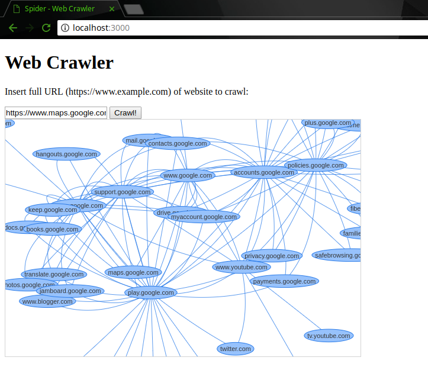

# spiderbot
web crawler created with javascript and node.js

Web crawler used to explore the World wide web. It starts in one website, crawls it internally (following the rules of the website) and gets the links of other websites to crawl, and it keeps repeating.

to use:

Install node.js and npm

then clone repository

`git clone https://github.com/AlexParra03/spiderbot.git`

move and install dependencies

`cd spiderbot`

`npm install`

then launch server

`node run start`

Open this URL on any browser:
`localhost:3000`
